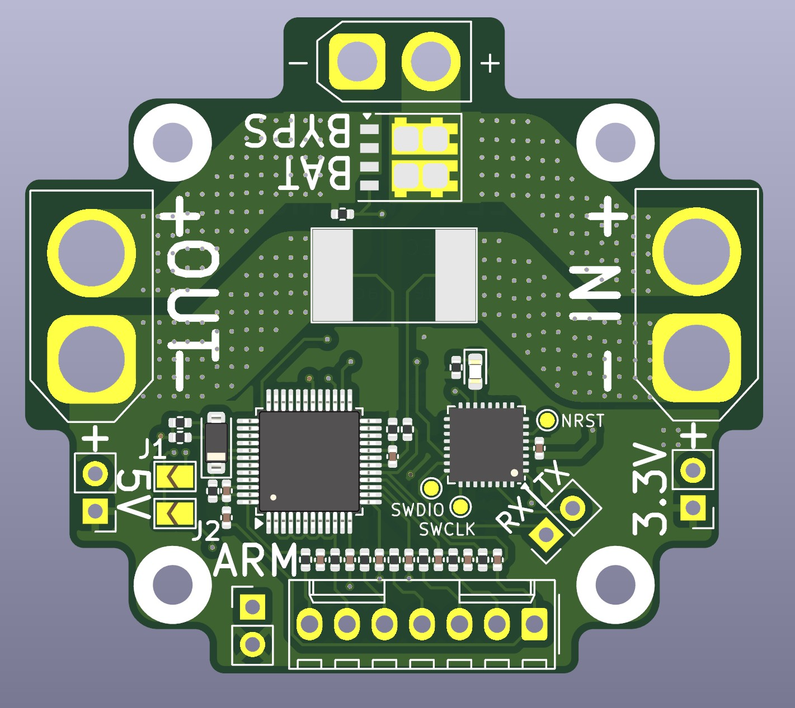

# CoCEL LiPo Battery Monitor

**A high-current LiPo battery monitor with individual cell voltage sensing**

[!IMPORTANT] 
This project is currently under development! Especially cell voltage monitoring circuit. Please stay tuned for future updates.

The CoCEL LiPo Battery Monitor is a dedicated power management and monitoring solution for multicopters. It measures total pack voltage, discharge current, and individual cell voltages, interfacing with a FC via UART.

## 1. Core Specifications

### Power
- **Voltage:** 4s~6s LiPo (14.8 V ~ 25.2 V)
- **Current:** 200 A continuous
- **Output Cutoff:** Main power output can be cut off via a physical arming switch (shorting pins) or via UART commands
- **Aux Power Output:**
    - 3.3 V (3 A)
    - 5 V (3 A)
    - Input Bypass: Dedicated power rail for an SBC (remains active even when the main output is cut off)

### Connectivity
- **Interfaces:** 
    - **Communication:** 1x UART
    - **Visual Feedback:** 1x Diagnostic LED
    - **Firmware update:** Test points are used for firmware updates (SWDIO, SWCLK, NRST).